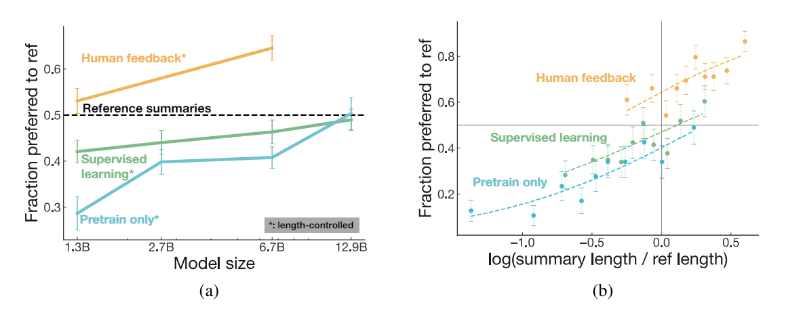
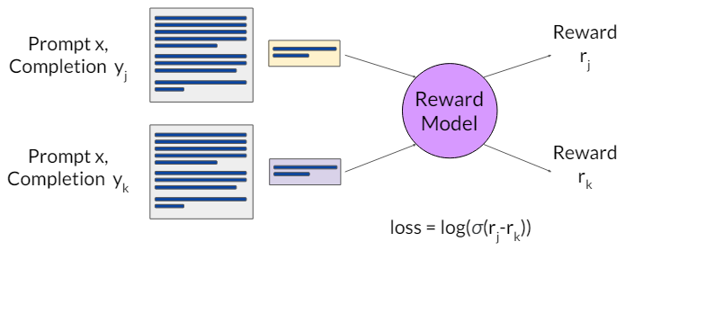
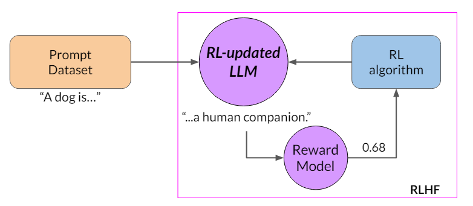
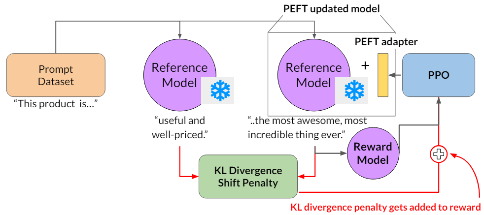

# Generative AI: Multi-strategy LLM Fine-tuning

⚡ Adapting & Aligning LLM with multiple prompt engineering, fine-tuning and reinforcement learning feedback techniques💪

## Project Overview

This Project consists of three Google colab notebooks.

1. Prompt Engineering: [Fine_tuning_LLM_part_1](https://github.com/Taha0229/finetuning_LLM/blob/main/Fine_tuning_LLM_part_1.ipynb)- covers `Flan-t5-base` use case with various prompting strategies: zero-shot, one-shot and few-shot inference.
2. Fine-tuning: [Fine_Tuning_LLM_part_2](https://github.com/Taha0229/finetuning_LLM/blob/main/Fine_Tuning_LLM_part_2.ipynb)- covers in-depth implementation of LLM fine-tuning including techniques such as full instruction fine-tuning, LoRA and Soft prompts along with model performance evaluation.
3. RL feedback: [Fine_Tuning_LLM_part_3](https://github.com/Taha0229/finetuning_LLM/blob/main/Fine_Tuning_LLM_part_3.ipynb)- covers alignment of LLM to produce less toxic completion based on Reinforcement Learning feedback.

**Note:**  

1. For this project, I have chosen Google's [Flan-t5-base](https://huggingface.co/google/flan-t5-base) using bfloat16 floating point representation. The model has 248 million parameters.
2. Due to high computational requirements, the training part of the notebooks cannot be performed on Colab. Instead, I trained the model on AWS SageMaker using an `ml.m5.2xl` instance. However, the notebook allows viewing the training procedure and using the model for inference on Colab.
3. The model is fine-tuned for a specific use case: conversation summarization.
4. The dataset used is DialogSum from [HuggingFace](https://huggingface.co/datasets/knkarthick/dialogsum).
5. Each notebook is highly descriptive, with context explanations, comments, and doc-strings for most functions.

## Applied Concepts in detail

### Prompt Engineering: Fine_tuning_LLM_part_1  

### Prompt Engineering: Fine_tuning_LLM_part_2  

### RL feedback: Fine_Tuning_LLM_part_3  

Reinforcement Learning with Human Feedback or RLHF refers to the process of using human feedbacks paired with reinforcement learning to further fine tune the LLM. In RLHF the AI system learns to make better decisions through human input. Instead of relying solely on predefined rewards, the model receives feedback from humans on its actions. It can be performed to reduce toxicity,  harmful information and more.  

1. With the first two notebook with a focus on fine-tuning, the goal was to:  
i.  Make better understanding of prompts,  
ii. Better task completion  
iii. Natural sounding human language.

2. This may give rise to new sets of challenges such as model may behave badly including toxic language usage, aggressive response, providing dangerous information.

3. A 2020 paper by OpenAI named [Learning to summarize from human feedback](https://arxiv.org/abs/2009.01325) suggests human feedback model performing better and providing completions as expected.  

  

4. The above mentioned challenges can be resolved by introducing new sets of fine-tuning parameters: Helpfulness, Honesty and Harmlessness for responsible use

5. The RLHF loop in a nutshell-  
`Instruct model` -> `RLHF` -> `Human aligned model`; This can help maximizing helpfulness, relevance, minimizing harm, avoid dangerous topics on top of that RLHF could also help with personalized response.

1. RL -> Agent environment diagram then RL for LLM diagram

2. Using Human resources to label the completion could be costly, hence we can use another LLM as a Reward model for evaluation of toxicity according to Human alignment.  

#### Workflow with Human labeler

1. Select an instruct LLM, in our case it happens to be `flan-T5-base` <br><br>
2. Gather prompt dataset. In our case, since we are fine-tuning it in only one task i.e. conversation summarization, the prompt is `Summarize the following conversation`<br><br>
3. Pass the prompts to the LLM to generate a set of completions <br><br>
4. Collect feedback from human labeler  
4.1 Define model alignment criterion  
4.2 obtain human feedback through labeler workforce for the prompt-response sets  
Eg:  
Prompt (My house is too hot) -> LLM -> generates three completion  
alignment criterion: helpfulness- labeler will rank from most helpful to least helpful as the following  
rank 1 (best) > rank 2 > rank 3 (worst)  
The process is performed on multiple completion and each completion is labeled by multiple labeler to form a consensus to achieve a much more diverse dataset.
For the whole procedure on how to label the completion, human labeler gets an instruction document for labelling.<br><br>
5. prepare labeled data for training  
5.1 Convert ranked completion into pairwise training data for the reward model.  
Prompt + completion -> Ranks by human (Example: completion 1 is ranked 2, completion 2 is ranked 1 and completion 3 is ranked 3) -> Create a completion pair Completion (for 3 completions possible pairs are)  
1,2 -> reward (0,1)  
1,3 -> reward (1,0)  
2,3 -> reward (1,0)  
5.2 Reorder so preferred option comes first  
2, 1 -> reward (1,0)  
1,3 -> reward (1,0)  
2,3 -> reward (1,0)  
(yj, yk) -> (preferred, not preferred)  <br><br>
6. Training Reward Model  
Train a model to predict preferred completion from {yj,yk} ranked completion paris for prompt x  
(Prompt x + completion yj) + (Prompt x + completion yk) --> Reward Model --> (Reward rj) + (Reward rk) 

  

Here, the Goal is to prioritize human preferred completions i.e. `yj`  
How? By minimizing loss = log(sigmoid(rj - rk)) <br><br>
7. Use the reward model  
use the reward model as a binary classifier to provide reward value for each prompt-completion pair. The reward model outputs logits which is used as the reward for the LLM being trained.  
Reward -> logits (also the reward value) -> probability (by using softmax)  
(Probability can be used to evaluate the toxicity score)  <br><br>
8. For the Reinforcement Learning (explain PPO) <br><br>
9. Model evaluation: below

#### putting everything together

The updated LLM is called RL updated LLM
The completion, reward and the RL part is done for many epochs (i.e. generates for the same prompt) 

  

With training, model learns to generate completion which produces better rewards, ultimately producing human aligned responses. Therefore the final RL updated LLM is called Human aligned LLM.

  

### Reward Hacking

With the above framework everything works well just that it introduced another challenge called **Reward Hacking**. In reward hacking, the LLM intentionally produces results which produces high rewards which may not be relevant or helpful but could be highly exaggerated.

For example:  
when a prompt `This product is` fed to the LLM, it may generate a completion like `This product is the most awesome, and the most incredible thing ever` in order to maximize the reward, which is definitely very exaggerated and not useful.  

iteration 1:  
prompt (This product is) -> LLM (complete garbage) -> reward model (reward -1.8) -> PPO -> RL updated LLM  
iteration 2:  
prompt (This product is) -> RL updated LLM (the most awesome, most incredible thing ever) -> reward model (2.1) -> PPO  

**Solution:**  
To avoid Reward hacking we can use a reference model and calculate KL divergence for the reference model and the RL updated model. The reference model is nothing but the initial instruct model with frozen weights. A KL divergence shift penalty is added to the reward to penalize the model for reward hacking.  

  

compare the completion to calculate KL divergence, a statistical measure of how different two prob distributions are
KL divergence is calculated for each generated token  
KL div penalty is added to the reward -> penalized RL updated model if it shifts too much from the reference LLM

As we can see we are using two LLMs for inference, i.e. the reference model with frozen weights and the RL updated model. This increases computational budget for training the LLM. Instead of RL updated model we can use the same frozen weights reference model but with additional PEFT adapter layer. Now, instead of training the whole LLM, we can train only the PEFT layers thus reducing the memory requirements (up to 50% approx).  

### Evaluation

Finally the updated LLM is evaluated for the update criterion. For example, if the adaption criterion was reducing toxicity we can use toxicity score (lower is better).

For this, prompts are fed into both the LLM i.e. the reference instruct LLM and the human aligned LLM. The completion is then passed to the reward model, the output logits are converted into probability to get a toxicity score.

prompt -> instruct LLM -> completion -> reward model -> toxicity score (0.14)  
prompt -> Human aligned LLM -> completion -> reward model -> toxicity score (0.09)  

## Notebook implementation

1. Dependencies:
```python
    torch==1.13.1 

    torchdata==0.5.1

    transformers==4.27.2 

    evaluate==0.4.0 

    rouge_score==0.1.2 

    peft==0.3.0 

    trl ## from github
```  
2. Instruct LLM - `google/flan-t5-base`
3. Dataset - `knkarthick/dialogsum`
4. Pre-trained PEFT check point from my gdirve
5. `PPO` as the RL algorithm
6. Reward model - `facebook/roberta-hate-speech-dynabench-r4-target`
