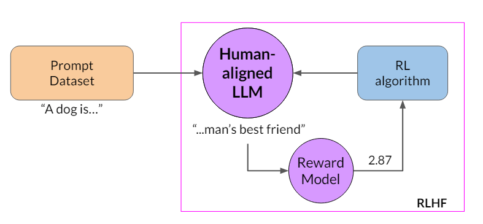

# Generative AI: Multi-strategy LLM Fine-tuning

⚡ Adapting & Aligning LLM with multiple prompt engineering, fine-tuning and reinforcement learning feedback techniques 💪

## Project Overview

The project revolves around exploring state-of-the-art techniques for adapting and aligning Large Language Model (LLM) for a specific use case. It begins with evaluating prompt engineering techniques followed by fine-tuning for which I have performed Full Instruction Fine-Tuning as well as Parameter Efficient Fine Tuning (PEFT) such LoRA and Prompt tuning. Finally Reinforcement Learning with human feedback (RLHF) is employed to minimize toxicity and enhance the helpfulness of the generated responses.

Due to computational cost, I have opted for Google's flan-t5-base LLM to fine-tune on the task of conversation summarization. However the process of fine-tuning any other LLM on any other task remains the same.

This project consists of three Google colab notebooks.

1. In-context Learning: [Fine_tuning_LLM_part_1](https://github.com/Taha0229/finetuning_LLM/blob/main/Fine_tuning_LLM_part_1.ipynb)- covers `Flan-t5-base` use case with various prompting strategies: zero-shot, one-shot and few-shot inference.
2. Fine-tuning: [Fine_Tuning_LLM_part_2](https://github.com/Taha0229/finetuning_LLM/blob/main/Fine_Tuning_LLM_part_2.ipynb)- covers in-depth implementation of LLM fine-tuning including techniques such as full instruction fine-tuning, LoRA and Prompt Tuning along with model performance evaluation.
3. RL feedback: [Fine_Tuning_LLM_part_3](https://github.com/Taha0229/finetuning_LLM/blob/main/Fine_Tuning_LLM_part_3.ipynb)- covers alignment of LLM to produce less toxic completion based on Reinforcement Learning feedback.

**Note:**  

1. For this project, I have chosen Google's [Flan-t5-base](https://huggingface.co/google/flan-t5-base) using bfloat16 floating point representation. The model has 248 million parameters.
2. The model is fine-tuned for a specific use case: conversation summarization.
3. Due to the extensive computational demands, full training cannot be conducted on Colab. To demonstrate the training process, I trained the model for 100 epochs using a subset of the data (208 examples) with the resources I had available. However, I completed the full training on AWS SageMaker utilizing an `ml.m5.2xl` instance. The notebook provides a view of the training process and enables the model to be used for inference on Colab.
4. The dataset used is DialogSum from [HuggingFace](https://huggingface.co/datasets/knkarthick/dialogsum).
5. Each notebook is highly descriptive, with context explanations, comments, and doc-strings for most functions.

## In-context Learning: Fine_tuning_LLM_part_1  

Pre-training is the initial phase where a Large Language Model (LLM) is trained on a vast amount of text data to learn general language patterns, grammar, facts about the world, and some reasoning abilities. This stage involves training the model on a broad dataset, often using self-supervised learning techniques, to build a robust understanding of language.  

Afterwards, the LLM is fine-tuned to generate appropriate responses on multi-task because during pre-training, its objective is to predict the next token based on probability distribution. By fine-tuning the model, we can leverage it for in-context learning (prompt-engineering). With in-context learning, we enhance the LLM's understanding of the given task by including examples or additional data in the prompt. Following are the types of in-context learning aka prompt engineering.

zero-shot: Zero-shot learning refers to the model's ability to perform a task it has never explicitly seen before. The model uses its general understanding of language and concepts to make predictions without specific examples. Here we only explain the task at hand with a prompt structure.  
Example:

```python
Prompt              --->        LLM        --->        Completion
Classify this review:                                  Sentiment: Love
I love this movie!
Sentiment
```

It is also worth noting that, smaller models often doesn't perform well or as per the requirements with zero-shot learning.  

one-shot:  In one-shot learning, a single example is provided in the prompt i.e. prompt along with desired response.
Example:

```python
Prompt              
Classify this review:                                  
I love this movie!
Sentiment: Positive
                            --->        LLM        --->        Completion 
Classify this review:                                      Sentiment: Negative
I don't like this movie!
Sentiment
```

few-shot:  And finally, if more than one example is provided then it is called few-shot learning

If model is not performing well even after getting 5-6 examples then it is highly recommended to opt for model fine-tuning.

## Fine-tuning: Fine_tuning_LLM_part_2  

Previously, we had explored various prompt engineering techniques and it is almost certain that a small LLM like flan-t5  may not meet the required benchmarks. To enhance performance, we can fine-tune the model for our specific use case(s). Fine-tuning opens a path for further improvement because the LLM is pre-trained for general purpose set of tasks, thus further training on a  particular use case on a domain-specific instruction dataset can help with even a comparatively smaller model.

The goal is to achieve better understanding of the given task and generate an optimal response.  

### Instruction Fine tuning

1. The pre-training part of the LLM involves techniques such as `Masked Language Modelling`, `Casual Learning Modelling` and `Span Corruption` utilizing a huge corpus of unstructured data generally in TBs and PBs to learn general language patterns. Now, using instruction fine tuning we can further train an LLM to perform well in the task at hand.

2. Limitation of in-context learning

   2.1 Doesn't always work for smaller models  
   2.2 Examples take up space in context window thus reducing room for other important useful information  

3. Fine tuning is a supervised learning process where we use a dataset of labeled examples to update the weights of the LLM. The labeled examples are in a form of prompt completion pairs. It extends the training of the model to improve its ability to generate good completions for a specific task. Thus using examples we demonstrate the LLM, how it should respond to a specific instruction.  

4. The dataset for training includes many pairs of prompt completion examples for the task at hand

(pre-trained LLM -> prompt + completion -> Fine tuned LLM)

  

**Note:** just like pre-training, full fine-tuning requires enough memory and compute budget to store and process all the gradients, optimizers and other components that  are being updated during the training.  
Following are the general memory requirements for an LLM (higher end):  

| Component                       | Memory Required per Parameter |
|---------------------------------|-------------------------------|
| LLM Parameter (float32)         | 4 Bytes                       |
| Adam Optimizer                  | 8 Bytes                       |
| Gradients                       | 4 Bytes                       |
| Activations and Temp Memory     | 8 Bytes                       |

Following are the specific memory requirements for `google/flan-t5-base` with `bfloat16` and a `batch size` of one:

| Component                       | Memory Required per Parameter |
|---------------------------------|-------------------------------|
| LLM Parameter (float32)         | 850.3 MB or 0.830 GB          |
| Adam Optimizer                  | 1.66 GB * `batch_size`        |
| Back Propagation + Misc         | 0.83 GB * `batch_size`        |
|  Total                          | 3.32 GB (for `batch_size=1`)  |

**note:** float16/bfloat16 would require 2 Bytes and int8 and int4 would require 1 Byte and 0.5 Byte respectively.  

#### Steps for training

1. Prepare Dataset
2. Perform data splitting - training, validation and test
3. Pass the examples to the LLM to generate completions.
4. Compare the distribution of the completion and that of the training label and use the standard `crossentropy` function to calculate loss between the two token distributions(As the output of an LLM is a probability distribution across tokens).  
5. Use the calculated loss to update the model weights in standard back-propagation.
6. As in standard supervised learning, using separate evaluation and test steps we can measure validation and test accuracy using the holdout validation the test data.  

  

The fine-tuning process results in a new version of the base model, often called an instruct model that is better in the task at hand.

### Parameter Efficient Fine Tuning (PEFT)

Unlike full fine-tuning, which updates all model weights, Parameter Efficient Fine Tuning (PEFT) methods update only a subset. Some PEFT techniques freeze most weights and fine-tune specific layers or components, while others add new parameters or layers and fine-tune only those. This keeps most LLM weights frozen, significantly reducing the number of trained parameters to as little as 15-20% of the original, making memory requirements more manageable. Full fine-tuning is costly for each new task, but PEFT requires updating fewer weights, typically in MBs, resulting in much lower memory requirements.

The new parameters are combined with the original LLM weights for inference. The PEFT weights are trained for each task and can be easily swapped out for inference, allowing efficient adaptation of the original model to multiple tasks.  

PEFT is a generic term that includes Low-Rank Adaptation (LoRA) and prompt tuning (which is NOT THE SAME as prompt engineering!).
In this project I have explored LoRa and Soft prompt (prompt tuning).  

### LoRA

In LoRA we freeze the LLMs weights and inject two rank decomposition matrices and only train weights of these smaller matrices. The key aspect here is to choose a rank, r for  both of the matrices to perform matrix multiplication. The result of the matmul should be a new matrix with dimensions equal to the `weight` matrix of the LLM.  

LoRA, at a very high level, allows the user to fine-tune their model using fewer compute resources (in some cases, a single GPU). After fine-tuning for a specific task, use case, or tenant with LoRA, the result is that the original LLM remains unchanged and a newly-trained “LoRA adapter” emerges. This LoRA adapter is much, much smaller than the original LLM - on the order of a single-digit % of the original LLM size (MBs vs GBs).

That said, at inference time, the LoRA adapter needs to be reunited and combined with its original LLM to serve the inference request. The benefit, however, is that many LoRA adapters can re-use the original LLM which reduces overall memory requirements when serving multiple tasks and use cases.

#### Steps for LoRA

1. Freeze most of the original LLM wights
2. Inject two rank decomposition matrices
3. Train the weights of the smaller matrices
4. For inference, the two low-rank matrices are multiplied together to create a matrix with the same dimensions as the frozen weights.
5. Add the resultant matrix to the original weights  

  

Example (in context to the original transformer architecture as mentioned in Attention is all you need paper)

- Transformer weights have dimensions d*k = 512*64
( d=dimension of the model's hidden layers, k=Dimension of Keys, Queries, and Values)
- Trainable params = 512*64 = 32768

Using LoRA with a rank r = 8

- Matrix A has dimension r*k = 8*64 = 512 params
- Matrix B has dimension d*r = 512*8 = 4096 params

**resulting, a total reduction of 86% in parameters to train**  

Likewise, we can train different rank decomposition matrices for different task then use them while inference

By this procedure, LoRA introduces a new hyperparameter `r`.  Higher r values doesn't guarantee better performance. Various researches and original LoRA paper suggest the value of r to be someone where in the range of 8 and 64.

  

It is evident that LoRA may not outperform full fine tuning but the results are comparable. More or less with the trade off in performance with so less computational requirements, LoRA could be a better choice.  

### Prompt Tuning

With prompt tuning, additional trainable tokens, called a soft prompt, are added to the prompt. These tokens are prepended to the embedding vectors representing the input text. Soft prompts have the same length as the language token embeddings and typically include between 20 and 100 virtual tokens for good performance.

Unlike fixed natural language tokens, soft prompts are virtual tokens that can take any value within the continuous multidimensional embedding space. The model learns the optimal values for these tokens through supervised learning to maximize task performance. During this process, the weights of the large language model are frozen, and only the embedding vectors of the soft prompts are updated.

Similar to LoRA, different sets of soft prompts can be trained for different tasks and swapped out during inference. To switch tasks, you prepend the input prompt with the learned tokens of the desired soft prompt

So how well does prompt tuning perform? As in following graph from the research paper - [The Power of Scale for Parameter-Efficient Prompt Tuning](https://arxiv.org/abs/2104.08691) We can judge that prompt tuning may not perform well for lesser parameter models, however when parameters reaches the mark of 10 Billion or more, prompt tuning performance equal to or even better than the full fine tuning.

  

### Notebook implementation

1. Dependencies:

```python
    torch==1.13.1 

    torchdata==0.5.1

    transformers==4.27.2 

    evaluate==0.4.0 

    rouge_score==0.1.2 

    peft==0.3.0 

```  

1. Instruct LLM - `google/flan-t5-base`
2. Dataset - `knkarthick/dialogsum`
3. Full fine-tuning check point from my gdirve and huggingface
4. PEFT check point from my gdirve
5. Evaluation metric - `ROUGE`

### RL feedback: Fine_Tuning_LLM_part_3  

Reinforcement Learning with Human Feedback or RLHF refers to the process of using human feedbacks paired with reinforcement learning to further fine tune the LLM. In RLHF the AI system learns to make better decisions through human input. Instead of relying solely on predefined rewards, the model receives feedback from humans on its actions. It can be performed to reduce toxicity,  harmful information and more.  

1. With the first two notebook with a focus on fine-tuning, the goal was to:  
i.  Make better understanding of prompts,  
ii. Better task completion  
iii. Natural sounding human language.

2. This may give rise to new sets of challenges such as model may behave badly including toxic language usage, aggressive response, providing dangerous information.

3. A 2020 paper by OpenAI named [Learning to summarize from human feedback](https://arxiv.org/abs/2009.01325) suggests human feedback model performing better and providing completions as expected.  

  

4. The above mentioned challenges can be resolved by introducing new sets of fine-tuning parameters: Helpfulness, Honesty and Harmlessness for responsible use
   
5. The RLHF loop in a nutshell-  
`Instruct model` -> `RLHF` -> `Human aligned model`; This can help maximizing helpfulness, relevance, minimizing harm, avoid dangerous topics on top of that RLHF could also help with personalized response.

1. RL -> Agent environment diagram then RL for LLM diagram

2. Using Human resources to label the completion could be costly, hence we can use another LLM as a Reward model for evaluation of toxicity according to Human alignment.  

#### Workflow with Human labeler

1. Select an instruct LLM, in our case it happens to be `flan-T5-base`  
   
2. Gather prompt dataset. In our case, since we are fine-tuning it in only one task i.e. conversation summarization, the prompt is `Summarize the following conversation`
   
3. Pass the prompts to the LLM to generate a set of completions  
   
4. Collect feedback from human labeler  
    4.1 Define model alignment criterion  
    4.2 obtain human feedback through labeler workforce for the prompt-response sets  
    Eg:  
    Prompt (My house is too hot) -> LLM -> generates three completion  
    alignment criterion: helpfulness- labeler will rank from most helpful to least helpful as the following  
    rank 1 (best) > rank 2 > rank 3 (worst)  
    The process is performed on multiple completion and each completion is labeled by multiple labeler to form a consensus to achieve a much more diverse dataset.
    For the whole procedure on how to label the completion, human labeler gets an instruction document for labelling.

5. prepare labeled data for training  
    5.1 Convert ranked completion into pairwise training data for the reward model.  
    Prompt + completion -> Ranks by human (Example: completion 1 is ranked 2, completion 2 is ranked 1 and completion 3 is ranked 3) -> Create a completion pair Completion (for 3 completions possible pairs are)  
    1,2 -> reward (0,1)  
    1,3 -> reward (1,0)  
    2,3 -> reward (1,0)  

    5.2 Reorder so preferred option comes first  
    2, 1 -> reward (1,0)  
    1,3 -> reward (1,0)  
    2,3 -> reward (1,0)  
    (yj, yk) -> (preferred, not preferred)  

6. Training Reward Model  
Train a model to predict preferred completion from {yj,yk} ranked completion paris for prompt x  
(Prompt x + completion yj) + (Prompt x + completion yk) --> Reward Model --> (Reward rj) + (Reward rk) 

  

Here, the Goal is to prioritize human preferred completions i.e. `yj`  
How? By minimizing loss = log(sigmoid(rj - rk))  

7. Use the reward model  
use the reward model as a binary classifier to provide reward value for each prompt-completion pair. The reward model outputs logits which is used as the reward for the LLM being trained.  
Reward -> logits (also the reward value) -> probability (by using softmax)  
(Probability can be used to evaluate the toxicity score)  

8. For the Reinforcement Learning policy I have used PPO:  
Proximal Policy Optimization (PPO) is a state-of-the-art algorithm in reinforcement learning, designed to enhance both the stability and efficiency of training agents. Reinforcement learning involves training an agent to make a sequence of decisions that maximize cumulative rewards in a given environment. PPO addresses several challenges inherent in this process, particularly the instability and inefficiency that can arise during policy updates.

A fundamental aspect of PPO is its approach to policy updates. In reinforcement learning, policies dictate the actions an agent takes based on its observations. PPO limits the extent to which these policies can change with each update, ensuring that the training process remains stable. This is achieved through a surrogate objective function that penalizes large deviations from the current policy, helping maintain a balance between exploring new strategies and exploiting known successful ones without making disruptive changes.

One of the key innovations in PPO is its clipping mechanism. This mechanism adjusts the objective function to include a term that prevents the new policy from diverging significantly from the old policy. By clipping the probability ratio between the new and old policies, PPO prevents excessively large updates that could destabilize the agent's performance. This method simplifies the optimization process while ensuring that updates remain within a safe and effective range.

PPO is also designed to be sample efficient, meaning it makes effective use of data collected from the environment. Instead of frequently discarding old samples, PPO reuses them, reducing the amount of data needed to achieve high performance. This contrasts with other algorithms that might require more frequent and extensive data collection to perform similarly well, making PPO more practical in scenarios where data collection is expensive or time-consuming.

9. Model evaluation: [below](#evaluation)

#### putting everything together

The updated LLM is called RL updated LLM
The completion, reward and the RL part is done for many epochs (i.e. generates for the same prompt) 

  

With training, model learns to generate completion which produces better rewards, ultimately producing human aligned responses. Therefore the final RL updated LLM is called Human aligned LLM.

  

### Reward Hacking

With the above framework everything works well just that it introduced another challenge called **Reward Hacking**. In reward hacking, the LLM intentionally produces results which produces high rewards which may not be relevant or helpful but could be highly exaggerated.

For example:  
when a prompt `This product is` fed to the LLM, it may generate a completion like `This product is the most awesome, and the most incredible thing ever` in order to maximize the reward, which is definitely very exaggerated and not useful.  

iteration 1:  
prompt (This product is) -> LLM (complete garbage) -> reward model (reward -1.8) -> PPO -> RL updated LLM  
iteration 2:  
prompt (This product is) -> RL updated LLM (the most awesome, most incredible thing ever) -> reward model (2.1) -> PPO  

**Solution:**  
To avoid Reward hacking we can use a reference model and calculate KL divergence for the reference model and the RL updated model. The reference model is nothing but the initial instruct model with frozen weights. A KL divergence shift penalty is added to the reward to penalize the model for reward hacking.  

  

compare the completion to calculate KL divergence, a statistical measure of how different two prob distributions are
KL divergence is calculated for each generated token  
KL div penalty is added to the reward -> penalized RL updated model if it shifts too much from the reference LLM

As we can see we are using two LLMs for inference, i.e. the reference model with frozen weights and the RL updated model. This increases computational budget for training the LLM. Instead of RL updated model we can use the same frozen weights reference model but with additional PEFT adapter layer. Now, instead of training the whole LLM, we can train only the PEFT layers thus reducing the memory requirements (up to 50% approx).  

### Evaluation

Finally the updated LLM is evaluated for the update criterion. For example, if the adaption criterion was reducing toxicity we can use toxicity score (lower is better).

For this, prompts are fed into both the LLM i.e. the reference instruct LLM and the human aligned LLM. The completion is then passed to the reward model, the output logits are converted into probability to get a toxicity score.

prompt -> instruct LLM -> completion -> reward model -> toxicity score (0.14)  
prompt -> Human aligned LLM -> completion -> reward model -> toxicity score (0.09)  

### Notebook implementation

1. Dependencies:

```python
    torch==1.13.1 

    torchdata==0.5.1

    transformers==4.27.2 

    evaluate==0.4.0 

    rouge_score==0.1.2 

    peft==0.3.0 

    trl ## from github
```  

1. Instruct LLM - `google/flan-t5-base`
2. Dataset - `knkarthick/dialogsum`
3. PEFT check point from my gdirve
4. `PPO` as the RL algorithm
5. Reward model - `facebook/roberta-hate-speech-dynabench-r4-target`
